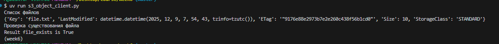
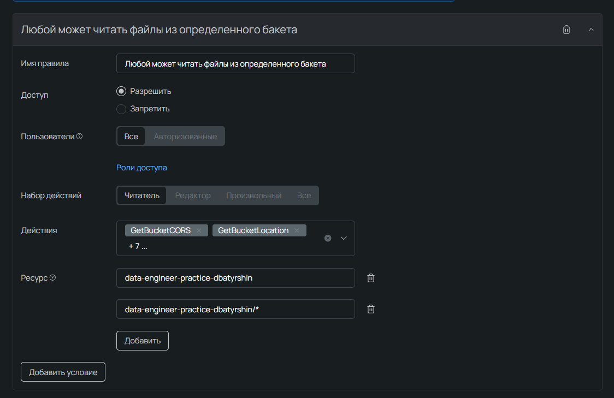
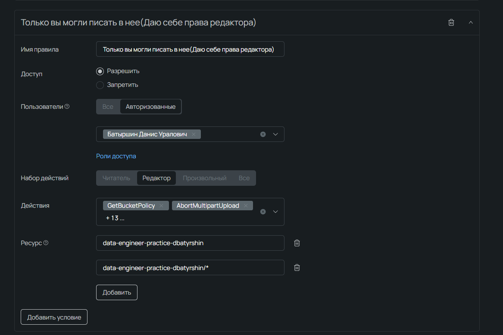
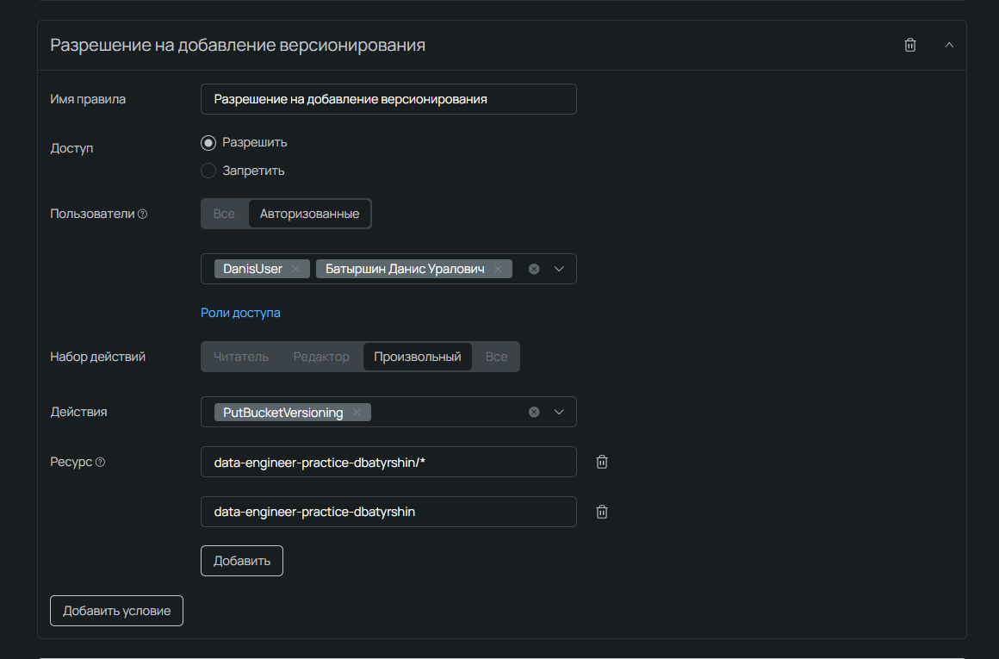
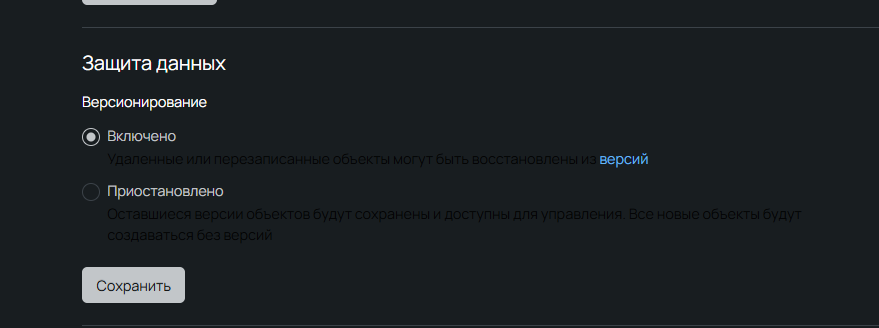
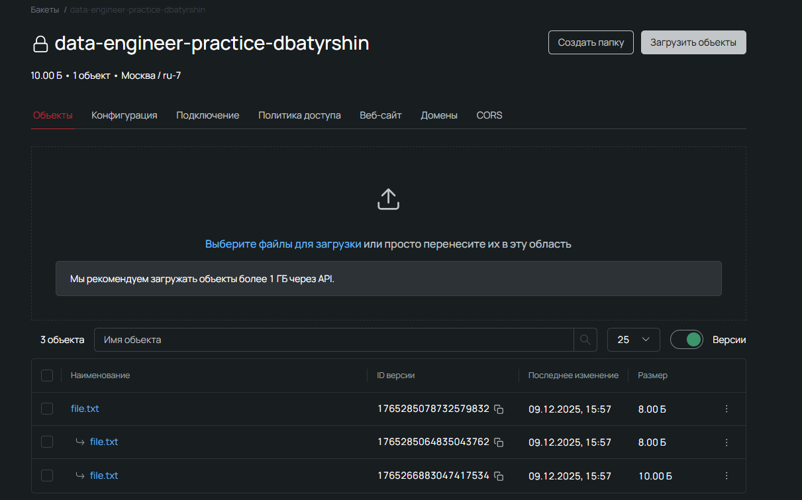
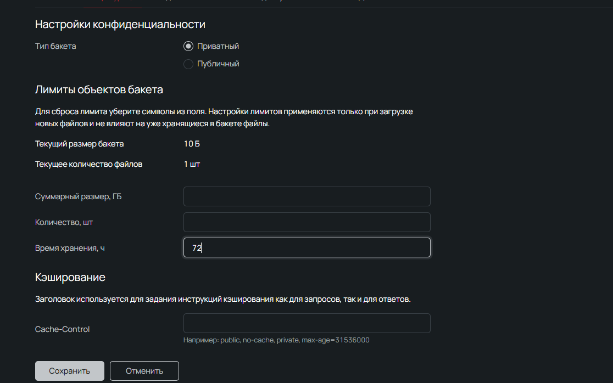
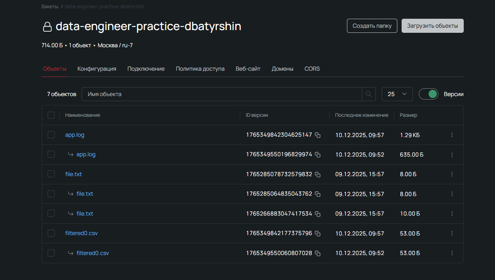

Задание 1

Ниже представлены скриншоты выполнения файла s3_object_client.py

Чтобы его запустить, необходимо(Если вы имеете доступ к хранилищу):
1. Выполнить в терминале 
```
pip install pyproject.toml
```
2. Заполнить .env
```
YOUR_ACCESS_KEY = 'ВВЕДИТЕ_СВОЙ_access_key'
YOUR_SECRET_KEY = 'ВВЕДИТЕ_СВОЙ_secret_key'
```

В данный момент доступ есть только у владельца, поэтому прикрепляю скриншоты

1. Запускаем скрипт, проверяем, что список файлов выгружается, далее проверяем "file.txt" на существование



Задание 2
Переходим к заданию 2, оно сделано через интерфейс Selectel

1. Добавляем всем пользователям права на чтение


2. Добавляем себе права на запись


3. Чтобы включить версионирование, сначала надо добавить на это права


4. Включаем версионирование


5. Загружаем "file.txt" несколько раз, смотрим версии и скачиваем нужную


6. В настройках конфигурации включаем время жизни файлов



Задание 3. Записал на видео.

https://disk.yandex.ru/i/zzVFxfAPg2swag

# UPD, на видео заметил, что забыл удалять исходный файл, добавил на 67 строчке pipeline_watchfiles.py
## UPD 2, после видео запустил ещё раз пайплайн, чтобы показать версионирование, вот скрин

