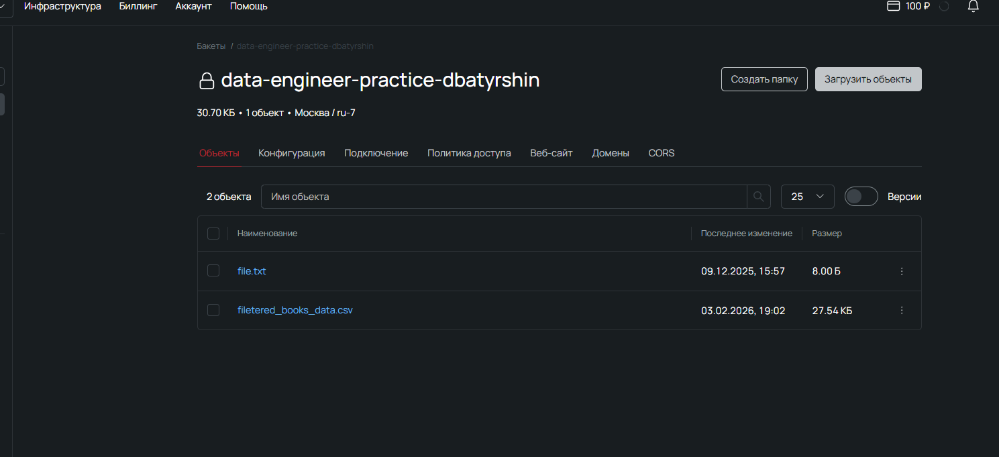

# Заметки к заданию
* CSV данные сохраняю в selectel, для загрузки использовал класс AsyncObjectStorage из 6 недели
Поэтому чтобы запустить код нужно как и в неделе 6:

1. Выполнить в терминале 
```
pip install pyproject.toml
```
2. Заполнить .env
```
YOUR_ACCESS_KEY = 'ВВЕДИТЕ_СВОЙ_access_key'
YOUR_SECRET_KEY = 'ВВЕДИТЕ_СВОЙ_secret_key'
```
3. Запуск
```
python main.py
```

* Пример csv данных после парсинга в файле filetered_books_data.exmple.csv
* Результат после загрузки в s3

